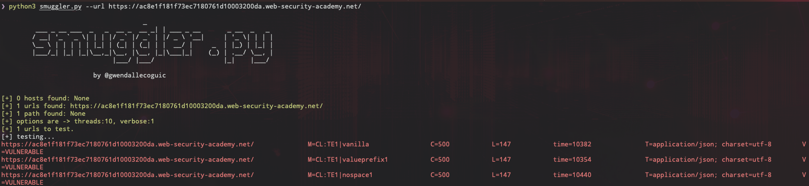

# Smuggler - A fuzz script to check for basic HTTP Request Smuggling vulnerabilities

## Summary

This script is shared by [Gwendal Le Coguic](https://github.com/gwen001/pentest-tools/blob/master/smuggler.py). However, it seems he did not maintain this script. So I fixed some of its bugs so that script can be used now.

The bug fixed in this version is the "Socket is not connected" error when using scripts with some websites.

